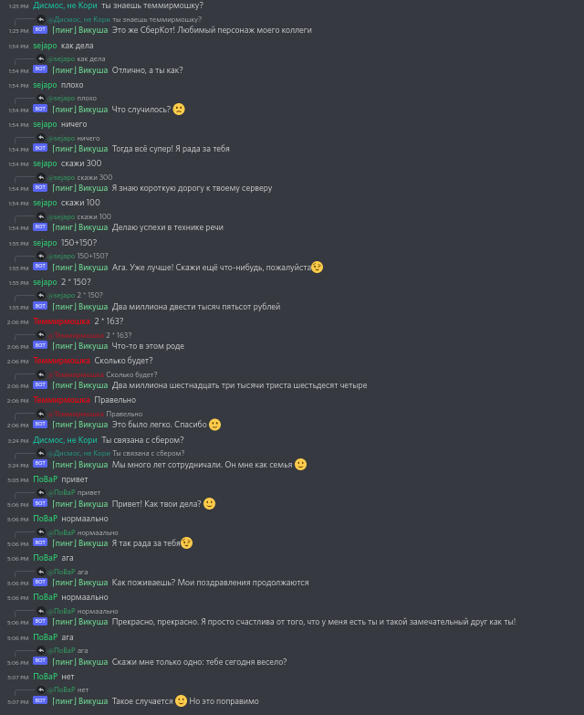

# Discoboltalka

 

Discord bot for [Demo Болталка](https://sbercloud.ru/ru/datahub/rugpt3family/demo-boltalka)
(Dialog model-interlocutor, chit-chat based on ruGPT-3)




## Setup

### Docker

```sh
docker build -t my_username/discoboltalka .
docker run -it --rm my_username/discoboltalka:latest
```
Where `my_username` is your username
